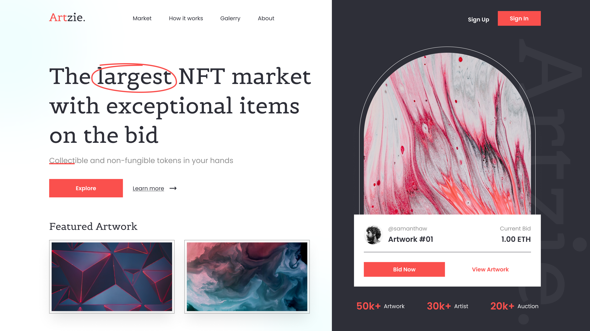

# HTML-SASS Header NTF Marketplace

## Descripción del proyecto :memo:

En este proyecto encontrarás el encabezado de "Artzie", una plataforma de mercado digital donde los usuarios pueden comprar y vender NFTs (tokens no fungibles). Se posiciona como el mercado líder en el espacio de los NFTs, ofreciendo una amplia variedad de obras de arte digitales únicas.

Un simple vistazo al header nos permite conocer la misión de la empresa sin ambigüedades de ninguna clase: "**The largest NFT market with exceptional items on the bid**"

## Vista previa del diseño :clipboard:

En la siguiente imagen se aprecia un detalle del resultado obtenido:

> [!WARNING]
> Este encabezado está diseñado para ofrecer una experiencia visual óptima en pantallas con una resolución de 1200px. De este modo se garantiza que los elementos visuales y la disposición del contenido se presenten de manera atractiva y efectiva en pantallas de este tamaño. 🖥️

## Uso :point_left:

Puedes reutilizar el código para tu propio proyecto web. Simplemente descárgate el repositorio y añádele los cambios necesarios para integrarlo en tu sitio.

## Contribuciones :information_desk_person:

¡Se aceptan contribuciones, claro que sí! Si encuentras algún problema o tienes alguna sugerencia de mejora, no dudes en ponerte en contacto conmigo y aportar tus ideas. Te lo agradeceré infinitamente :handshake:

 
 
